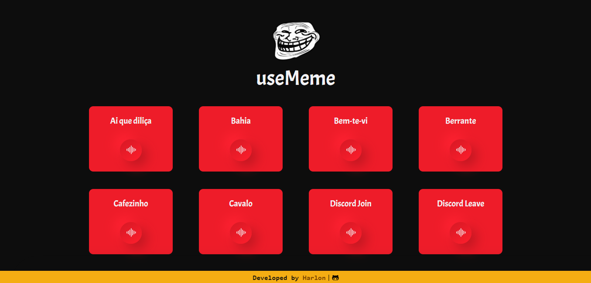

# <a href="https://usememe.netlify.app/">useMeme</a>



#
## Instalação e execução

```
# Clonando repositório e entrando na pasta root
$ git clone https://github.com/HarlonGarcia/useMeme.git && cd ./useMeme/

# Instalando dependências
$ npm install

# Rodando código
$ npm run dev
```

## Tech Stack

- [React](https://pt-br.reactjs.org/)
- [Sass](https://sass-lang.com/)
- [React Icons](https://react-icons.github.io/react-icons/)
- [Vite](https://vitejs.dev/) 

 

